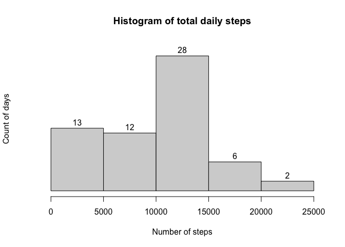
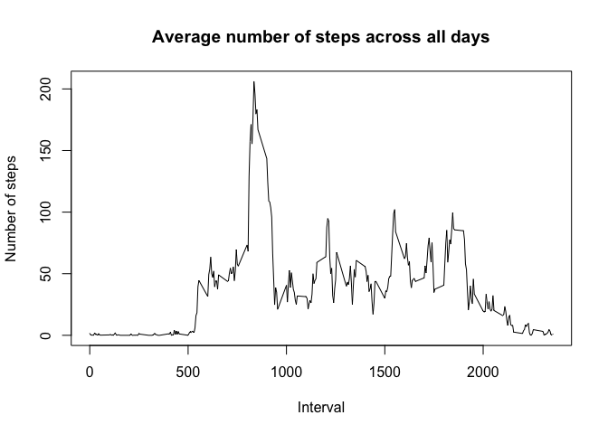
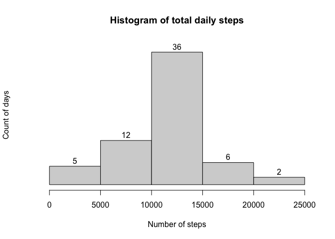
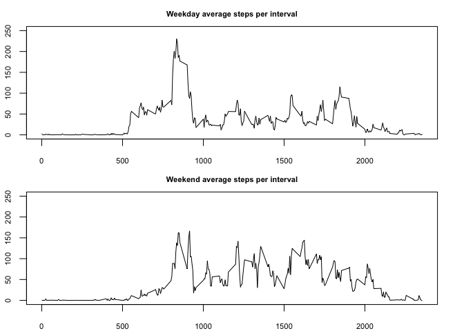

This assignment makes use of data from a personal activity monitoring device. This device collects data at 5 minute intervals through out the day. The data consists of two months of data from an anonymous individual collected during the months of October and November, 2012 and include the number of steps taken in 5 minute intervals each day.

## Loading and preprocessing the data

```r
comma <- function(x) format(x, digits = 2, big.mark = ",")

df <- read.csv('activity.csv')

df_daily <- tapply(df$steps, df$date, sum, na.rm = TRUE)

hist(df_daily, labels = TRUE, main = "Histogram of total daily steps",
     xlab = "Number of steps", ylab = "Count of days", yaxt = "n", ylim = c(0,30))
```

<!-- -->

By observing the histogram we conclude that: 

- for 13 days the total number of steps was between 0 and 5k, 
- for 12 days the total number of steps was between 5k and 10k, 
- for 28 days the total number of steps was between 10k and 15k, 
- for 6 days the total number of steps was between 15k and 20k, 
- for 2 days the total number of steps was between 20k and 25k. 

## What is mean total number of steps taken per day?

```r
mean(df_daily)
```

```
## [1] 9354.23
```

```r
median(df_daily)
```

```
## [1] 10395
```

The mean and median value of the steps are 9,354 and 10,395 respectively.

## What is the average daily activity pattern?

```r
df_interval <- tapply(df$steps, df$interval, mean, na.rm = TRUE)

intervals <- as.numeric(names(df_interval))
plot(intervals, df_interval, type = "l",main = "Average number of steps across all days",
     xlab = "Interval", ylab = "Number of steps")
```

<!-- -->

```r
df_interval[which.max(df_interval)]
```

```
##      835 
## 206.1698
```

It appears that there exists a peak in walking activity during the morning hours.
The exact interval that the peak takes place is 835
while the maximum number of steps per interval is 206.

## Imputing missing values

```r
sum(!complete.cases(df))
```

```
## [1] 2304
```

```r
sum(!complete.cases(df))/nrow(df)
```

```
## [1] 0.1311475
```

```r
# to impute the missing values we choose to use the 5-minute interval average

df_impute <- df
df_impute[is.na(df_impute$steps), 'steps'] <- sapply(df_impute[is.na(df_impute$steps), 'interval'],
                                                     function(x) df_interval[names(df_interval) == x])

sum(!complete.cases(df_impute))
```

```
## [1] 0
```

```r
sum(!complete.cases(df_impute))/nrow(df_impute)
```

```
## [1] 0
```

```r
df_daily_impute <- tapply(df_impute$steps, df_impute$date, sum, na.rm = TRUE)

mean(df_daily_impute)
```

```
## [1] 10766.19
```

```r
median(df_daily_impute)
```

```
## [1] 10766.19
```

```r
hist(df_daily_impute, labels = TRUE, main = "Histogram of total daily steps",
     xlab = "Number of steps", ylab = "Count of days", yaxt = "n", ylim = c(0,38))
```

<!-- -->

The total number of intervals with missing values in the original dataset was 2,304 which is 0.13 of the intervals. To fill in all of the missing values in the data set, the strategy we
followed was to use the mean for that 5-minute interval. The mean and median value
of the steps after imputing the data are 10,766 and 10,766 respectively. Both values increase which makes sense since
for the days for which data was not available the reported number of steps was 0. Also,
by imputing the missing values with the mean of the 5-minute intervals we observe that the 8
days with missing data that were in the first bin in the original histogram have now moved to the central bin.

## Are there differences in activity patterns between weekdays and weekends?

```r
df_impute$dayOfWeek <- weekdays(as.Date(df_impute$date))
table(df_impute$dayOfWeek)
```

```
## 
##    Friday    Monday  Saturday    Sunday  Thursday   Tuesday Wednesday 
##      2592      2592      2304      2304      2592      2592      2592
```

```r
df_impute$typeOfDay <- ifelse(df_impute$dayOfWeek %in% c("Saturday", "Sunday"), "weekend", "weekday")
table(df_impute$typeOfDay)
```

```
## 
## weekday weekend 
##   12960    4608
```

```r
df_impute_interval_tod <- with(df_impute, tapply(steps, list(typeOfDay, interval), mean))

par(mfrow = c(2,1), mar = c(2,2,2,2))
plot(intervals, df_impute_interval_tod[1,], type = "l", main = "Weekend average steps per interval", xlab = "", ylab = "", ylim = c(0, 250), cex.main = 0.7, cex.lab = 0.7, cex.axis = 0.7)
plot(intervals,df_impute_interval_tod[2,], type = "l", main = "Weekday average steps per interval", xlab = "", ylab = "", ylim = c(0, 250), cex.main = 0.7, cex.lab = 0.7, cex.axis = 0.7)
```

<!-- -->

The patterns appear to be similar on weekends and weekdays with the exception of 
the morning peak which appears to be more pronounced on the weekends.
